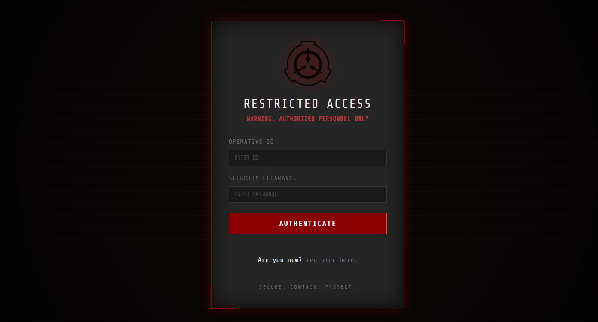
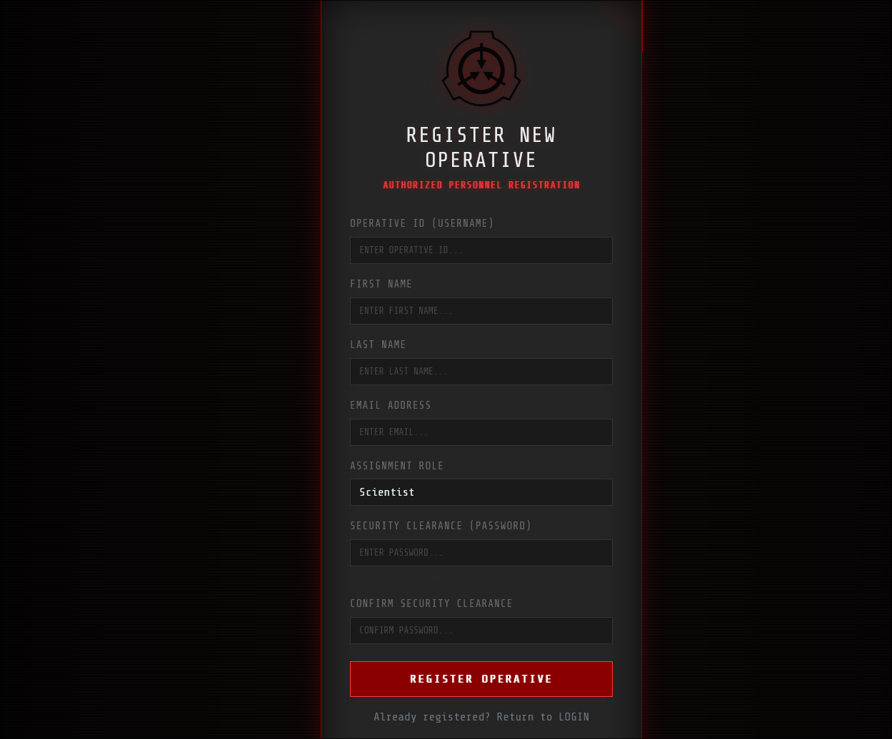
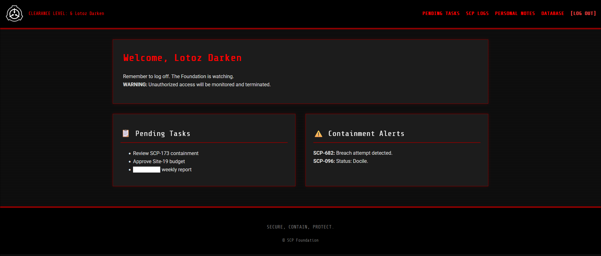
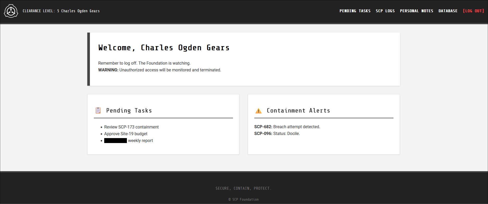
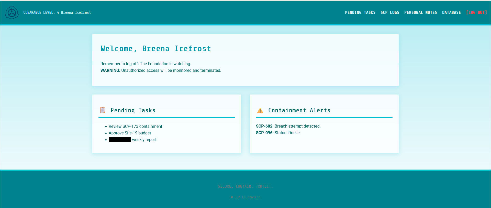
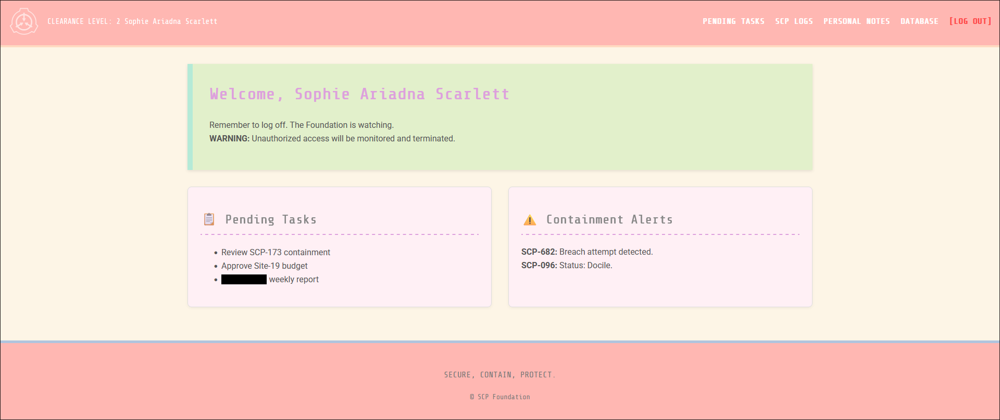
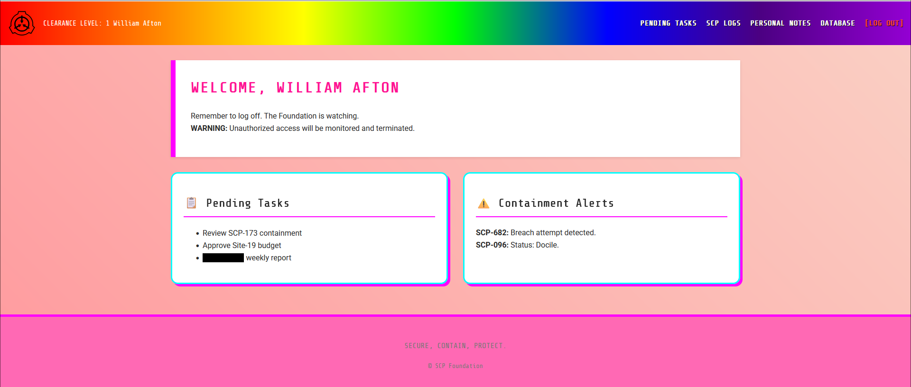
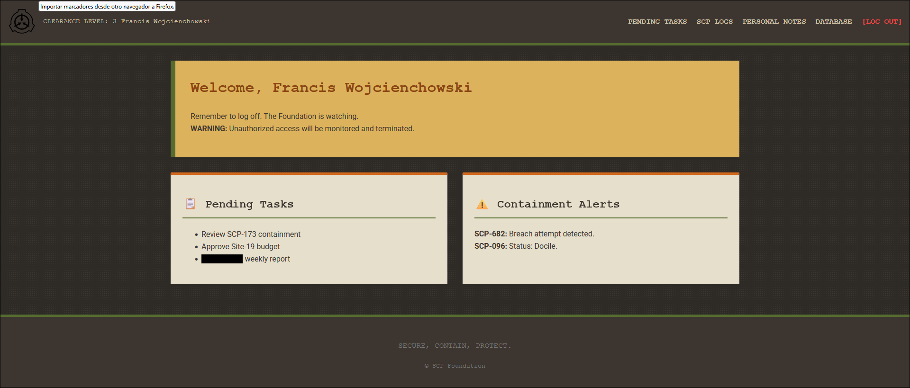

<div align="center">


**A pure PHP MVC project developed from scratch for learning purposes. The goal of this repository is to demonstrate the development process using an SCP Foundation theme.**
</div>

<p align="center">
  <a href="README.es.md">🇪🇸 Versión README en Español</a>
</p>

---

## 📋 Description

**SCP Login PHP** is a personal practice project focused on building a complete software architecture using native PHP.

Currently, the project features a **secure user login and registration system**. While the focus is now on authentication, future versions aim to include a CRUD system and a simulation of how this software would function within the **SCP Organization**. Note that the full simulation might be developed in a separate, future repository.

## 📍 Key Features

* **🛡️ Enhanced Security:** Implementation of security methods such as session blocking after too many failed attempts (Brute-force protection) and malicious code analysis/sanitization in both Frontend (JS) and Backend (PHP).
* **💾 Database Management:** Full handling of the database, allowing both authentication of existing users and registration of new personnel.
* **🍪 Session & State Management:** Practical implementation of Cookies and `$_SESSION`.
  * *Current:* Basic dashboard customization (themes) based on the user.
  * *Future:* Role-Based Access Control (RBAC) to restrict zones.
* **🏗️ Clean Architecture:** strict use of **Interfaces**, **Repositories**, and **Classes** to maintain Separation of Concerns (SoC) and avoid overloading any single file.

---

## 🛠️ Project Structure

The project follows an intuitive and scalable folder organization:

```text
SCP_LOGIN_PHP/
├── config/              # DB connection configuration and Exceptions
├── controllers/         # Controllers (e.g., AuthController)
├── interfaces/          # Repository contracts (IUserRepository)
├── models/              # Business Logic & Entities (User, SessionManager)
├── repositories/        # Data access implementation (MariaDB)
├── views/               # UI Files (Login, Register, Dashboard)
│   └── assets/          # Static resources (CSS, JS, Images)
├── index.php            # Application entry point
├── scp_data.sql         # Database import script
├── passwordandusers.txt # Test credentials (For development only)
└── README.md
```

---

### 📸 Pictures

| Login | Register | Dashboard |
|-------|----------|-----------|
|  |  |  |

**Temas Disponibles:**

| Gears | Ice | Sophie |
|-------|-----|--------|
|  |  |  |

| Unicorn | Clef | Admin |
|---------|------|-------|
|  |  |  |

---

### ⬇️ Installation

Follow these steps to run the project in your local environment (XAMPP, WAMP, Docker, etc.):

1. Clone the repository

```bash
git clone [https://github.com/Lotoz/SCP_LOGIN_PHP.git](https://github.com/Lotoz/SCP_LOGIN_PHP.git)
cd SCP_LOGIN_PHP
```

2. Configure the Database

* Create a new database in your manager (phpMyAdmin, Workbench, etc.).

* Import the scp_data.sql file included in the root of the project.

>Note: You don't need to manually configure a database user in the PHP files if you use the import, as the system is set up to work with the imported configuration (or standard local credentials).

3. Run

Open your browser and navigate to your local server: <http://localhost/SCP_LOGIN_PHP/>

⚠️ **Linux/Mac Users:** If you are using XAMPP on macOS or Linux, remember to grant the necessary read/write permissions to the project folder for it to work correctly.


<div align="center"> <sub>Developed with ❤️ by <a href="https://github.com/Lotoz">Lotoz</a></sub> </div>
